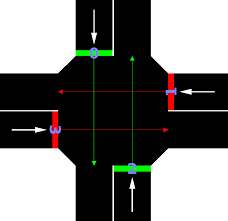

# Artificial Intelligence Developer | IT works engineer

#### Technical Skills: Python, SQL, Power BI, OpenCV, MATLAB, Pandas, Matplotlib, Numpy.

## Education

- M.S., Artificial Intelligence | Higher School of Electronic Communications and Poste at Niamey (_December 2024_)
- B.S., Analysis & Programming | African Instituite of Computer Science (IAI) at Niamey (_November 2021_)

## Work Experience

**Web Project Manager @ Sirba Communication (_June 2022 - Present_)**

- IT project management | Analysis and modeling | Software development | Data collection and analysis.

**Web developper Consultant @ Food Processing Company (_December 2021 - August 2022_)**

- Implementation of a web/mobile platform (using React) for billing management and geolocation of sales points aimed at increasing profitability.

## Projects

### Traffic Light Control Using Deep Q-Learning Agent

[Publication](https://www.mdpi.com/1424-8220/22/8/3048)

This project aims to revolutionize traffic light management at an urban intersection using a Deep Q-Learning reinforced learning agent. By simulating traffic flow with the **SUMO **(Simulation of Urban Mobility) tool, the main objective is to optimize vehicle travel times by minimizing their waiting time.

-

### Projec
